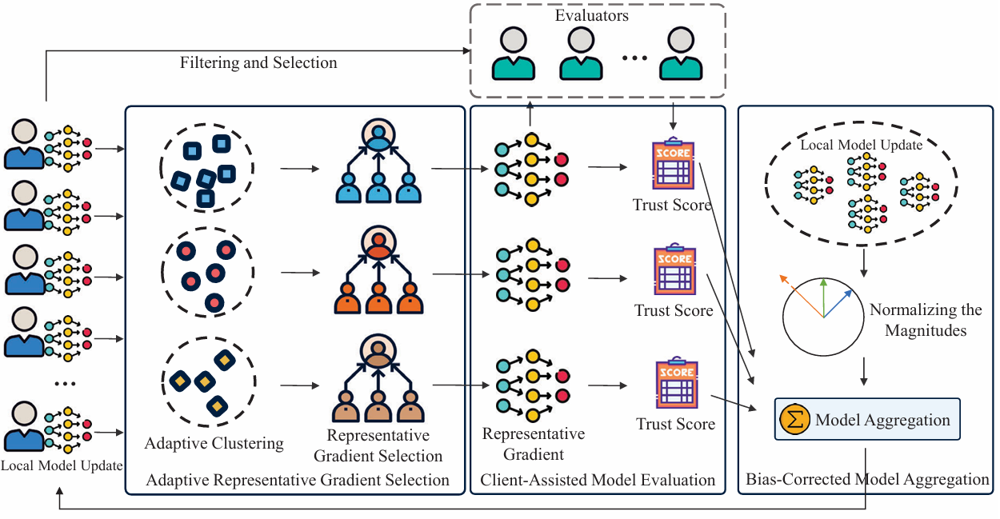

## [TrustCom 2025] FedTPD: Dual Gradient Evaluation-Based Defense Against Poisoning Attacks in Federated Learning
<p align="center"></p>

### Overview
This repository provides the implementation of **FedTPD**, a poisoning-resilient federated learning defense proposed in TrustCom 2025.

Federated learning is vulnerable to both data poisoning and model poisoning due to decentralized local training and limited server visibility. Existing defenses often rely on strong assumptions (e.g., IID behavior, trusted auxiliary/root datasets). FedTPD addresses this through a **dual gradient evaluation** pipeline that does not require a trusted root dataset.

### Method (FedTPD)
FedTPD consists of three coordinated mechanisms:

1. **Adaptive Representative Gradient Selection (ARS)**  
   - Clusters client gradients adaptively (with cosine-distance-based similarity and adaptive cluster number selection).  
   - Selects representative gradients per cluster (median-based), improving robustness to outliers.

2. **Client-Assisted Model Evaluation (CME)**  
   - Uses a two-stage filtering strategy to identify reliable evaluators from client updates.  
   - Computes trust scores for representative gradients using cosine similarity against a benchmark gradient.

3. **Bias-Corrected Model Aggregation (BCA)**  
   - Normalizes gradient magnitudes and aggregates updates with trust-aware weighting.  
   - Reduces the impact of malicious directions and exaggerated gradient scales.

### Key Points From the Paper
- Handles multiple poisoning threats, including label flipping and gradient-ascent-based attacks.
- Avoids heavy dependence on pre-collected clean root datasets.
- Improves both `Accmax` and `Accavg` across CIFAR-10, CIFAR-100, and Fashion-MNIST in the reported experiments.
- Maintains strong performance across varying malicious-client ratios.

### Quick Start

```
#!/usr/bin/env bash

lr=0.01
dataset='cifar'
model='resnet'
defence='fedtpd'
malicious=0.4
poison_frac=0.5
local_ep=2
local_bs=64
attack_begin=0
epochs=400
attack_label=4
attack_goal=-1
trigger='square'
triggerX=27
triggerY=27
gpu=0
iid=0
save='results'
num_users=100
frac=0.5
attack_values=('SF')
for attack in ${attack_values[@]}; do
    python main_fed.py \
        --dataset ${dataset} \
        --model ${model} \
        --attack ${attack} \
        --lr ${lr} \
        --malicious ${malicious} \
        --poison_frac ${poison_frac} \
        --local_ep ${local_ep} \
        --local_bs ${local_bs} \
        --attack_begin ${attack_begin} \
        --defence ${defence} \
        --epochs ${epochs} \
        --attack_label ${attack_label} \
        --attack_goal ${attack_goal} \
        --trigger ${trigger} \
        --triggerX ${triggerX} \
        --triggerY ${triggerY} \
        --gpu ${gpu} \
        --iid ${iid} \
        --save ${save} \
        --num_users ${num_users} \
        --frac ${frac}
done

```

### Recommended Experimental Setup (Paper-Aligned)
- `num_users=100`, `frac=0.5`
- non-IID partitioning (`iid=0`)
- poisoning ratio typically set around `malicious=0.4`
- common attacks include label-flip and gradient-ascent variants

### Paper
- Title: *Dual Gradient Evaluation-Based Defense Method Against Poisoning Attacks in Federated Learning*
- Venue: IEEE TrustCom 2025
- DOI: [10.1109/Trustcom66490.2025.00018](https://doi.org/10.1109/Trustcom66490.2025.00018)

### Citation
If this repository helps your research, please cite:

```bibtex
@inproceedings{zhang2025fedtpd,
  title={Dual Gradient Evaluation-Based Defense Method Against Poisoning Attacks in Federated Learning},
  author={Zhang, Zhuangzhuang and Yan, Xinhai and Wu, Libing and Liu, Bingyi and Wang, Enshu and Wang, Jianping},
  booktitle={2025 IEEE 24th International Conference on Trust, Security and Privacy in Computing and Communications (TrustCom)},
  year={2025},
  doi={10.1109/Trustcom66490.2025.00018}
}
```

### Reference
[1] https://github.com/zhmzm/Poisoning_Backdoor-critical_Layers_Attack

[2] https://github.com/qzzqzzb/A3FL

[3] https://github.com/SleepedCat/RoseAgg

[4] https://github.com/zhenqincn/Snowball

[5] https://github.com/ybdai7/Backdoor-indicator-defense
